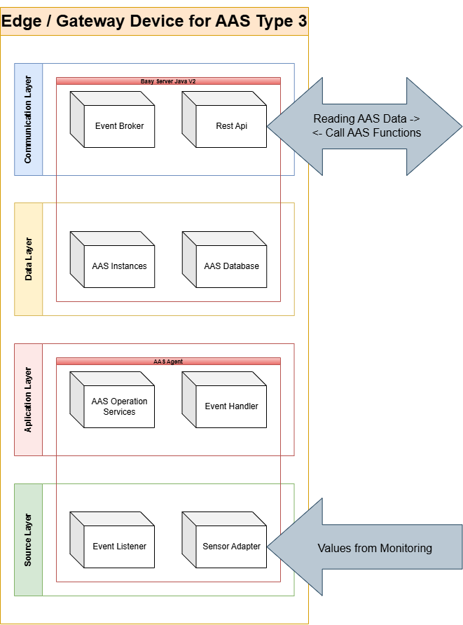
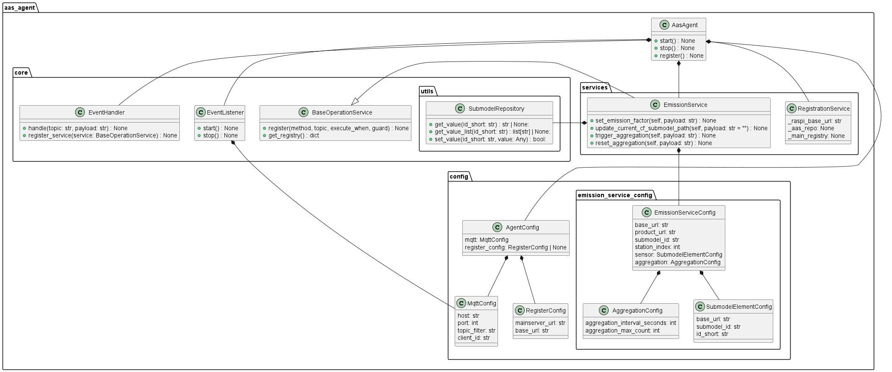

# AAS Agent

The AAS Agent is an event-driven runtime component that extends a static Asset Administration Shell (AAS), such as an Eclipse BaSyx server, with dynamic behavior.

**Already available:**
- AAS Type 1 functionality (static data representation) with [Eclipse BaSyx™](https://basyx.org/) ([BaSyx Java Version 2](https://wiki.basyx.org/en/latest/content/user_documentation/basyx_components/v2/index.html) or [BaSyx Go](https://github.com/eclipse-basyx/basyx-go-components))

**It enables:**
- AAS Type 2 functionality (live data integration) by reacting to incoming data streams (e.g. via AAS, fieldbuses or directly connected sensors)
- AAS Type 3 functionality (active operations) by executing domain-specific actions based on AAS state changes

The agent continuously monitors AAS-related events and maps them to executable operations.

---

## Why use an AAS Agent?

While platforms like [Eclipse BaSyx™](https://basyx.org/) provide a solid foundation for managing AAS data (Type 1), they do not natively support reactive or autonomous behavior.

The AAS Agent is an exemplary implementation to close this gap through the introduction of:

- Reactive processing of AAS changes
- Automated execution of operational routines

This turns a passive digital model (Type 1) not only into a digital shadow (Type 2) but into an active digital twin (Type 3).

---

## Software Architecture

<p align="center">
  
</p>

---

## Class Diagram

<p align="center">
  
</p>

---

## Installation and Usage

### Prerequisites

- [Python](https://www.python.org/downloads/) 3.10+
- A running AAS server (e.g. [Eclipse BaSyx](https://basyx.org/))

---

### 1. Install `uv`

```bash
pip install uv
```

Verify your installation:

```bash
uv --version
# Expected output: uv 0.10.8 or similar
```

---

### 2. Clone the Repository

```bash
git clone https://github.com/Crauder00/Aas_Agent.git
cd AAS_AGENT
```

---

### 3. Install Dependencies

Inside the `AAS_AGENT` folder, run:

```bash
uv sync
```

---

### 4. Configure the Agent

Open `main.py` and adjust the configuration to your environment, or integrate the configuration block into your own application.

All available configuration options are located in:
AAS_AGENT/aas_agent/config/
> **Note:** You do not need to modify the config files directly — all options can be set via `main.py`.

---

### 5. Prepare Your AAS Server

Make sure your AAS server is running before starting the agent (e.g. Eclipse BaSyx Java V2 or BaSyx Go).

Then upload the initial asset to your server — choose one of the following approaches:

**Option A — Upload via `.aasx` file:**
Use your AAS server's UI or API to upload the provided `Asset.aasx` package directly.

**Option B — Upload via script:**
```bash
python utils/upload_initial_properties.py
```

> **Note:** The script needs a target URL. Make sure it is configured correctly before running it.

---

### 6. Start the Agent

#### Manually (Windows)

```bash
.venv\Scripts\activate.bat
python main.py
```

#### Manually (Linux / macOS)

```bash
source .venv/bin/activate
python main.py
```

#### Automatically on Linux via systemd

Create a new service file:

```bash
sudo nano /etc/systemd/system/aas-agent.service
```

Paste the following content, adjust the paths to your setup and update the logic to your needs:

```ini
[Unit]
Description=AAS Agent
After=network.target

[Service]
Type=simple
User=pi
WorkingDirectory=/home/pi/AAS_AGENT
ExecStart=/home/pi/.local/bin/uv run python main.py
Restart=on-failure
RestartSec=5
StandardOutput=journal
StandardError=journal
Environment=PYTHONUNBUFFERED=1

[Install]
WantedBy=multi-user.target
```

Enable and start the service:

```bash
sudo systemctl daemon-reload
sudo systemctl enable aas-agent.service
sudo systemctl start aas-agent.service
```

Check the status or logs:

```bash
sudo systemctl status aas-agent.service
sudo journalctl -u aas-agent.service -f
```

---

## Extending with Custom Use Cases

Additional use cases can be added under `aas_agent/services/` as Python modules.

> **Important:** Every custom service **must** inherit from `aas_agent/core/base_operation_service.py` to ensure compatibility with the agent's execution lifecycle.

```
aas_agent/
└── services/
    ├── your_custom_service.py   ← inherits from BaseOperationService
    └── ...
```

Once your service is implemented, register it in `main.py` by adding it to the `services` list and passing it to the agent:

```python
def main() -> None:
    ...

    services = [
        EmissionService(emission_config_station_0),
        EmissionService(emission_config_station_1),
        YOUR_OTHER_SERVICES_HERE(your_config_0)  # Add more services if needed
    ]

    ...

    agent = AasAgent(agent_config, services)

    ...
```

---

## Known Limitations

- **`registration_service`** is currently under active development and not yet production-ready.
- **BaSyx Go Server** does not yet support MQTT eventing — reactive event-driven behavior requires the BaSyx Java V2 server for the time being.